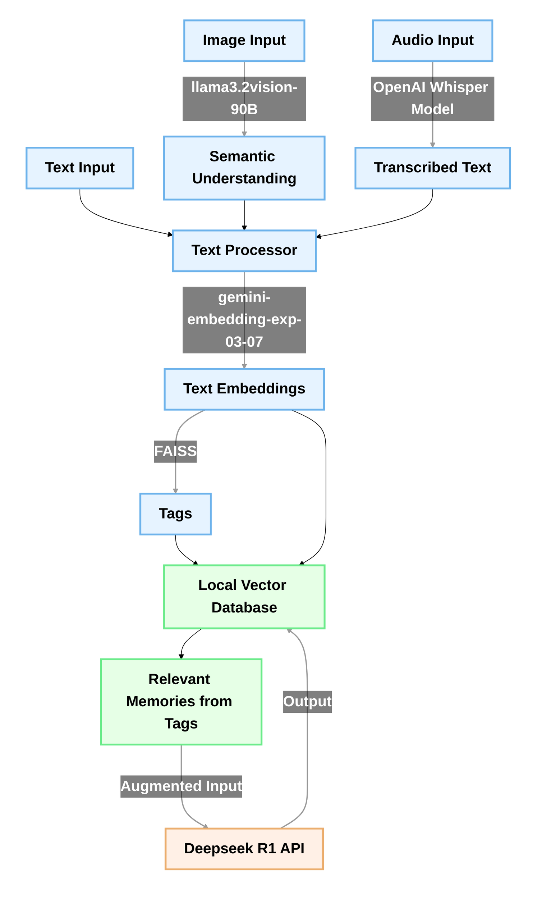

# Memory‑Enhanced Multimodal DeepSeek Chat Framework

> **Research prototype** • Local‑first, privacy‑aware • Images + Audio + Text • Long‑term vector memory • FastAPI / CLI / Tk GUI

---

## ✨ At a glance

| Capability | Implementation |
|------------|----------------|
| **Chat backbone** | [DeepSeek API](https://deepseek.com) wrapper (`openai`‑compatible)
| **Long‑term memory** | FAISS vector index (L2) + Gemini embeddings + fuzzy tag ranking
| **Summaries** | Chunked BART‑CNN summariser to fit ≤ 3 000 tokens of history
| **Images → text** | Ollama **llama3.2‑vision** (90 b) via Python client
| **Audio → text** | HF **Whisper‑large‑v3** (
`pipeline("automatic‑speech‑recognition")`)
| **User surfaces** | • CLI (`deepseek_chat.py`)  • Tk GUI (`deepseek_gui.py`)  • REST API (`server_deepseek.py` / `proxy_server.py`)  • Stand‑alone voice‑recorder GUI (`audio_with_GUI.py`)
| **Persistence** | `memory.index` (FAISS) + `memory_meta.json` (human‑readable)

---

## 1  Project motivation
The modern LLM API landscape offers outstanding reasoning, but **stateless prompts forget everything**. This repo explores a *hybrid memory architecture* that

1. **Persists every conversation turn** (text / image description / audio transcript) in a local vector store;
2. **Resurfaces the most relevant memories** on each request using *semantic + fuzzy tag* scoring;
3. **Keeps token budgets under control** via hierarchical summarisation;
4. **Supports true multimodality** while staying totally offline for heavy models (Ollama & HF pipelines run locally).

The result is a *research sandbox* for long‑lived AI agents you can run on your laptop.

---

## 2  Architecture overview

*Every surface shares the **same** memory engine and scoring logic.*

---

## 3  Directory layout
```
.
├── deepseek_chat.py          # Core CLI + memory engine
├── deepseek_gui.py           # Lightweight Tkinter front‑end
├── server_deepseek.py        # FastAPI JSON API (memory‑aware)
├── proxy_server.py           # Same as above, alt entry‑point
├── voice_processor.py        # Simple Whisper helper class
├── audio_with_GUI.py         # Microphone recorder & live transcription
├── llama32vision.py          # Thin wrapper around Ollama REST
├── test.py                   # Smoke‑test against local proxy
├── requirements.txt          # PyPI deps (pin your own versions!)
├── memory.index              # FAISS – auto‑generated
├── memory_meta.json          # Plain‑text metadata
└── README.md                 # ← you are here
```

---

## 4  Quick start
### 4.1 Prerequisites
* Python ≥ 3.10
* [Ollama](https://ollama.ai) (for vision) **OR** comment‐out image calls
* GPU optional but recommended for Whisper & BART summarisation

### 4.2 Installation
```bash
# 1 Clone & enter
$ git clone https://github.com/YOUR‑HANDLE/deepseek‑memory.git
$ cd deepseek‑memory

# 2 Create venv (recommended)
$ python -m venv .venv && source .venv/bin/activate

# 3 Install deps
$ pip install --upgrade pip wheel
$ pip install -r requirements.txt  # ≈ 2 GB incl. HF models

# 4 Pull optional models
$ ollama pull llama3.2-vision:90b   # Vision LLM (~ ?? GB)
$ ollama pull llava:7b              # Smaller fallback
```

### 4.3 Environment
```bash
export GEMINI_API_KEY=...   # Google AI Studio
export DEEPSEEK_API_KEY=... # https://platform.deepseek.com
# Optional: change OLLAMA_HOST/PORT in llama32vision.py if remote
```

---

## 5 Running the demos
| Mode | Command | Notes |
|------|---------|-------|
| **CLI** | `python deepseek_chat.py` | type `exit` to quit, or `stop recording memory` to pause persistence |
| **GUI** | `python deepseek_gui.py` | Upload image/audio from toolbar buttons |
| **REST** | `uvicorn proxy_server:app --host 0.0.0.0 --port 8000` | Compatible with OpenAI SDK → point `base_url` to `http://127.0.0.1:8000/v1` |
| **Voice recorder** | `python audio_with_GUI.py` | Records mic → Whisper → adds to memory |
| **Smoke test** | `python test.py` | Sends one prompt through local proxy |

Example `curl`:
```bash
curl http://localhost:8000/v1/chat/completions \
     -H 'Content-Type: application/json' \
     -d '{
           "model": "deepseek-chat",
           "messages": [{"role":"user","content":"Recall what eecs123 equals"}]
         }'
```

---

## 6 Memory scoring recipe
1. **Semantic similarity** – cosine ≈ (`1/(1+L2)`) via Gemini embeddings.
2. **Recency decay** – items fade ~1 h half‑life.
3. **Personal‑preference boost** – (+50 %) if query & entry both tagged `preference`.
4. **Fuzzy tag overlap** – Levenshtein ≥ 80 % → +10 % per extra hit.

The top‑*k* (default = 5) entries are concatenated above the live user prompt and sent to DeepSeek.

---

## 7 Security & privacy
* **Never commit API keys** – example keys in code are *invalid* placeholders.
* All multimodal processing (images, raw audio) happens **locally**; only the derived description/transcript is sent upstream.
* Memory files live beside the repo; delete `memory.*` to wipe history.

---

## 8 Benchmarks & limitations
* Runs ~12 token/s on an RTX 4090 (DeepSeek streaming).
* `llama3.2‑vision:90b` needs ≈ 41 GiB RAM → use **`llava:7b`** or cloud if not available.
* Whisper long‑form (> 30 s) requires `return_timestamps=True` or chunking; see code.
* Not production‑grade; race conditions possible under heavy REST load.

---

## 9 Roadmap
- [ ] Switch embeddings to **DeepSeek‑Embedding‑002** once released
- [ ] Deno DB backend instead of flat JSON
- [ ] Electron / Tauri GUI rewrite
- [ ] Unit tests & CI (pytest + Ruff)

---

## 10 Citation
If you use this code in academic work, please cite:
```text
@misc{deepseek_memory_2025,
  author = {Rajdeep Mukherjee, Ziyao Yan, Adarsh Bharathwaj, Cal Kantamneni, Tod Manlaibaatar},
  title  = {Memory‑Enhanced Multimodal DeepSeek Chat},
  year   = {2025},
  url    = {https://github.com/Tombow1/eecs545project}
}
```

---

## 11 License
This project is released under the **MIT License**.  See `LICENSE` for details.

---

> **Acknowledgements**  DeepSeek, Google Gemini, HuggingFace, FAISS, Ollama, and the open‑source community.

